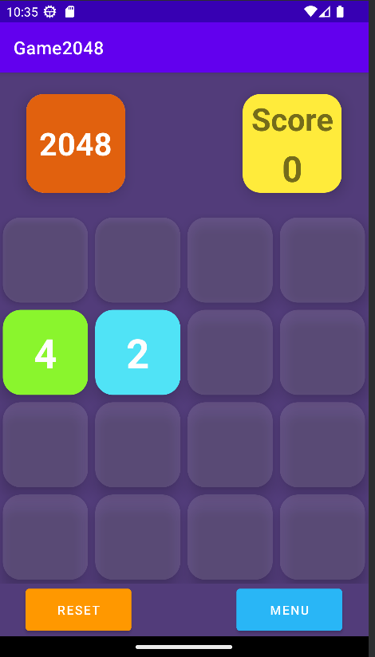
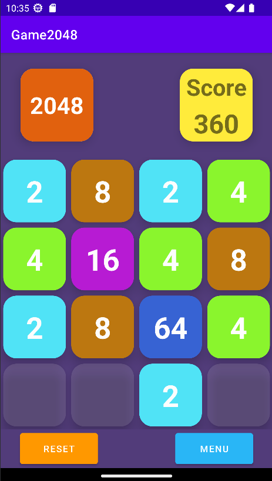
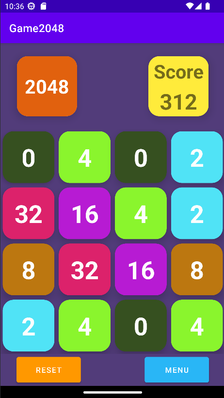
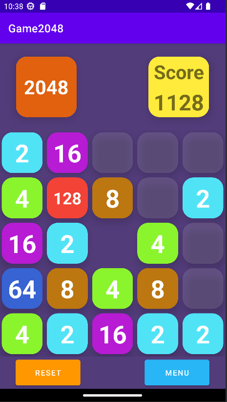
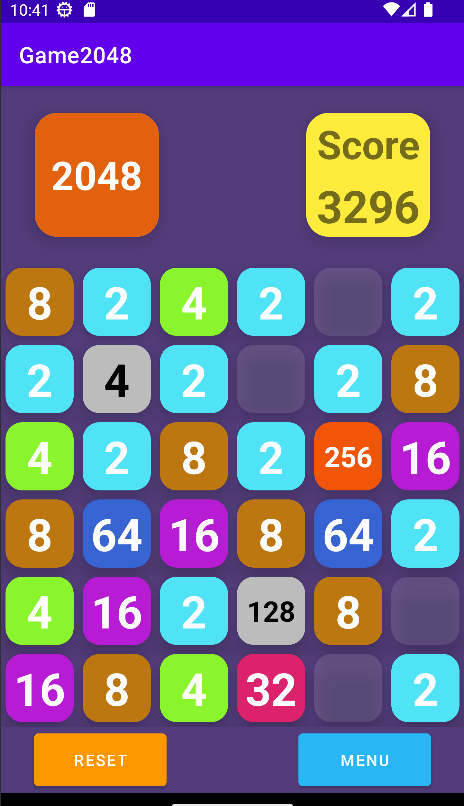

# COMP 4521 Final Project: 2048 Game

## Problems Remaining (To be removed in final report)

1. The layout of the icon "**2048**" in the top-left corner and the scoreboard in the top-right
   corner are currently subject to the constraints such as paddings in the linear layout, thus they
   can not keep the shape of square upon drawn in different screen. (SOLVED)
2. Media player is suggested to be added. (SOLVED partially. Good wav file for synthesis not found yet)
3. Some images could be added to menu page. However, I didn't find a view to set the background of
   the CardView while keep the background of TextView transparent. And also, I want to keep the
   width/height ratio of images.
4. Compared with 6\*6 map, perhaps there can be some more creative features in 5\*5 map.

## Game Introduction

(Extracted from Wikipedia)

2048 is played on a plain 4×4 grid, with numbered tiles that slide when a player moves them using
the four arrow keys. Every turn, a new tile randomly appears in an empty spot on the board with a
value of either 2 or 4. Tiles slide as far as possible in the chosen direction until they are stopped
by either another tile or the edge of the grid. If two tiles of the same number collide while moving,
they will merge into a tile with the total value of the two tiles that collided. The resulting tile
cannot merge with another tile again in the same move. Higher-scoring tiles emit a soft glow; the
highest possible tile is 131,072.

If a move causes three consecutive tiles of the same value to slide together, only the two tiles
farthest along the direction of motion will combine. If all four spaces in a row or column are
filled with tiles of the same value, a move parallel to that row/column will combine the first two
and last two. A scoreboard on the upper-right keeps track of the user's score. The user's score
starts at zero, and is increased whenever two tiles combine, by the value of the new tile.

More details here: [Game 2048](https://en.wikipedia.org/wiki/2048_(video_game))

## How To Play

### Initial Page: Classic 4*4

Upon the game started, player will enter the classic 4*4 mode of the game.

Player can slip on the map to perform four kinds of Actions: UP, DOWN, LEFT and RIGHT.

Button `RESET`: Clicking on this button will initialize the game to allow you to start again. Also,
it will clear the score before and reset it to zero.

Button `MENU`: Go to the menu page.

### Menu Page

(img)

As shown, player can choose to switch to other game mode.

For three games played in 4*4 map, if user choose the original mode before entering the menu,
they can continue the game without resetting.

For other games in larger map, unfortunately their progress will lose immediately after entering the
menu, as they are designed to be challenging modes.

## More Game Modes

To enrich the content and the value of this Android Applications, another four game modes were
added.

### Speed Mode

Generation of new tiles are not based on the actions player performed i.e. one new tile after one
action. Instead, new tiles will appear in a fixed rate, regardless of player's actions.

If there is no empty position to generate a new tile, the game will end.

The generation will start after player has performed the initial action. When player go to the
menu or reset the game, the timer will pause.

At the beginning, player may find that the game is very easy. However, after they have more and larger
tiles, they may feel that new tiles are hard to deal with, although the generation rate actually will
never increase.

### Zero Mode

What if we have tiles that can never increase themselves?

In this mode, there is a probability (actually 0.1, hardcoded by developer) that a new tile with
number 0 will be generated. They are also subject to the game rule, so that two 0s can be merged
into one 0. However, after the initial 0 is generated, you can never get rid of it!

Except for those 0 tiles, the game is exactly the same as classic 4*4 mode.

### Classic 5*5

Although its name is 'classic 5*5', there is a little bit difference.

The middle of the map is removed. Not only that tiles can't be placed here, they can not move across
the blank position as well.

Except for the blank position, it is the same as classic mode.

### Classic 6*6

As the map is very large, it has been added some special features to prevent players from getting bored.

First, two new tiles will be generated after one position, instead of one. 
Next, after a while when the player perform the initial action, there will be two positions 'frozen'
in the map.

> Introduction of the 'freezing' rule
> 1. Tiles cannot move across those 'frozen' positions.
> 2. If a frozen position has a tile before frozen, this tile will also be frozen to this position. It
     > can neither be moved, nor merge with other tiles.
> 3. A frozen position will be unfrozen after a short period and two new positions will be frozen then.

If player makes plans, it's possible to leverage those 'frozen' positions and turn it
into an advantage.

